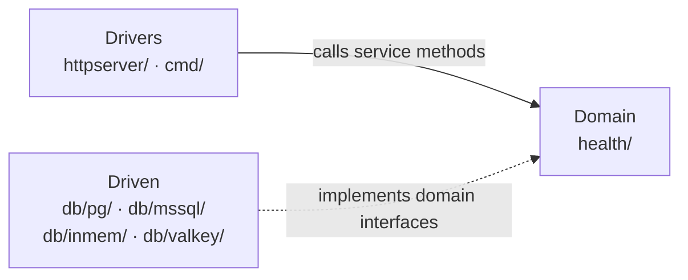

# Architecture

This template uses **Hexagonal Architecture** (also called Ports and Adapters). The central idea is one rule: **all dependencies point toward the domain**. The domain never imports from the database layer or the HTTP layer — they import from it.

## The Three Areas



The solid arrow means _calls_: Drivers call the domain directly.
The dashed arrow means _implements_: Driven adapters satisfy interfaces that the domain defined — the domain never calls them directly, it only knows the interface.

**Drivers** receive the outside world (HTTP requests, scheduled triggers) and translate them into calls on the domain service. They know about HTTP — the domain does not.

**Domain** contains the business rules. It defines what operations exist and what data looks like — but has no idea how data is stored or how requests arrive. Nothing in `health/` imports from `db/` or `httpserver/`.

**Driven** adapters implement the interfaces that the domain defined. `db/pg/` knows SQL. `db/inmem/` stores data in a map. `db/valkey/` stores cache entries in Valkey. All of them depend on the [repository interface](../health/repository.go) defined in `health/` — not the other way around.

## What is an Interface? (and why it matters)

An **interface** in Go is a contract: it says _what_ a type can do, without saying _how_. For example, `health.Repository` says "I need something that can store and retrieve a Ping" — but says nothing about Postgres, MSSQL, or any other technology.

```go
type Repository interface {
    GetHealth(ctx context.Context) (Health, error)
    Ping(ctx context.Context, message string) (Ping, error)
}
```

Any type that has those two methods satisfies this interface automatically. This gives two important benefits:

**1. Swap implementations without changing the domain.**
`db/inmem/` and `db/pg/` both implement `Repository`. The domain service (`health.Service`) receives a `Repository` — it never knows which one. Switching from in-memory to Postgres is a wiring change in `cmd/`, not a change to any business logic.

**2. Test the domain without a real database.**
Because the domain only depends on the interface, tests can pass a fake or in-memory implementation instead of a real database. This keeps unit tests fast, isolated, and runnable with `make test` — no Docker, no database setup required.

In hexagonal architecture, this interface is called a **Port** and each concrete implementation is called an **Adapter**. The domain owns the port (the interface). The adapters live in `db/` and implement it.

An **Adapter** knows about a specific technology (Postgres, MSSQL, in-memory map) but presents the domain-defined interface to its callers. Because all adapters satisfy the same interface, the domain service can use any of them interchangeably.

A **Decorator** is a special kind of adapter: it wraps another adapter that satisfies the same interface and adds behaviour on top — without the wrapped adapter knowing. The cache layer in `db/valkey/` is a decorator: it wraps any `Repository`, serves results from cache when available, and falls back to the underlying adapter on a miss. The service receives a `Repository` — it has no idea caching is happening at all.

## DDD Concepts in This Template

### Value Object — `health/model.go`

A **Value Object** represents a concept by its content, not by identity. Two `Health` values with the same `Status` are equal — there is no "this specific Health" to track over time. Value Objects are descriptive and carry domain meaning that a plain `string` or `int` would lose.

```go
type Health struct {
    Status        string
    CheckedAtUnix int64
}

type Ping struct {
    Message        string
    ReceivedAtUnix int64
}
```

`NewPing` is a guarded constructor — it validates the message and stamps the timestamp. Validation lives here in the domain, not in the HTTP handler.

### Application Service — `health/service.go`

An **Application Service** coordinates a use case. It receives a request, calls the repository through the port interface, and returns a result. It does not make business decisions itself — those belong to domain objects.

`health.Service` has methods like `GetHealth` and `Ping`. It holds a `Repository` interface and has no knowledge of whether the underlying adapter is Postgres, MSSQL, or an in-memory map. That choice is made once, at startup, in `cmd/`.

```go
// GetHealth retrieves the current health status.
// The service calls the Repository port — it does not know whether
// the adapter behind it is Postgres, MSSQL, or in-memory.
func (s *Service) GetHealth(ctx context.Context) (GetHealthOutput, error) {
    health, err := s.repository.GetHealth(ctx)
    if err != nil {
        return GetHealthOutput{}, err
    }
    return GetHealthOutput(health), nil
}
```

`s.repository` is the Port interface. Whichever Adapter was wired in `cmd/` answers the call. The service has no `import` from `db/` — that is the whole point.

### Port — `health/repository.go`

The **Port** is the interface the domain defines to describe what it needs from the outside world. The domain says "I need something that can store and retrieve a Ping" — without specifying how.

```go
// Repository is the persistence port for the health domain.
// Implementations live in db/pg, db/mssql, and db/inmem — never here.
type Repository interface {
    GetHealth(ctx context.Context) (Health, error)
    Ping(ctx context.Context, message string) (Ping, error)
}
```

Ports are owned by the domain. Adapters live in `db/` and implement them.

## Folder Map

| Folder        | Area   | Role                                                               |
| ------------- | ------ | ------------------------------------------------------------------ |
| `health/`     | Domain | Value Objects, Application Service, Port interfaces                |
| `db/pg/`      | Driven | Adapter — Repository implementation (PostgreSQL)                   |
| `db/mssql/`   | Driven | Adapter — Repository implementation (MSSQL)                        |
| `db/inmem/`   | Driven | Adapter — Repository implementation (in-memory, tests + local dev) |
| `httpserver/` | Driver | HTTP route registration and handler functions                      |
| `cmd/server/` | Driver | Binary entry point — wires all layers together                     |
| `cmd/task_*/` | Driver | Short-lived ECS task entry points                                  |
| `config/`     | Shared | Env var loading — no layer coupling                                |

## The Golden Rule

> If you find yourself importing `db/` from `health/`, or importing `httpserver/` from `health/`, stop. Move the logic to the right layer.

The direction of imports enforces this separation. Run `go list -f '{{.Imports}}' ./health/...` to verify `health/` never imports adapters.

## Related

- [db/README.md](../db/README.md) — persistence adapters, transactions, and migrations
- [health/README.md](../health/README.md) — what lives in the domain package
- [ADR index](./adr/) — rationale for key decisions
- [DDD Implementation Reference](../.claude/skills/ddd-implementation-skill/SKILL.md) — comprehensive guide to DDD patterns: Entities, Value Objects, Aggregates, Domain Services, Application Services, and more
